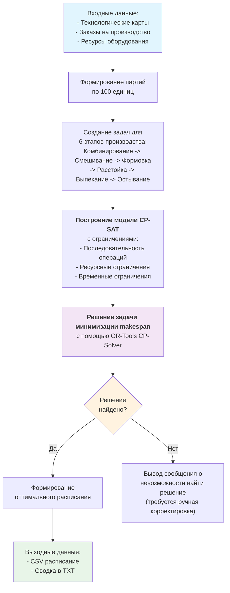

# Блок-схемы для алгоритмов планирования

Здесь представлены блок-схемы для трех различных подходов к решению задачи планирования производства.

---

## 1. Алгоритм на основе CP-SAT (`time_min.py`)

Этот подход использует точный математический решатель для поиска оптимального решения.



---

## 2. Генетический Алгоритм (`ga_copy.py`)

Этот эвристический подход симулирует процесс эволюции для поиска "достаточно хорошего" решения.

```mermaid
flowchart TD
    A[Входные данные:<br/>- Технологические карты<br/>- Заказы на производство<br/>- Ресурсы оборудования] --> B[Формирование партий<br/>по 100 единиц]
    
    B --> C[Создание задач для<br/>6 этапов производства]
    
    C --> D[<b>Настройка Генетического Алгоритма (DEAP)</b><br/>• Определение структуры "индивида"<br/>• Фитнес-функция (оценка makespan)<br/>• Операторы: скрещивание, мутация, селекция]
    
    D --> E[Создание начальной<br/>случайной популяции решений]
    
    E --> F[<b>Цикл эволюции (N поколений)</b>]
    subgraph F
        direction TB
        F1[Оценка приспособленности<br/>каждого индивида в популяции] --> F2[Селекция лучших индивидов]
        F2 --> F3[Скрещивание и мутация<br/> для создания нового поколения]
    end
    
    F --> G[Извлечение лучшего<br/>индивида из всех поколений]
    
    G --> H[Формирование расписания<br/>на основе лучшего индивида]
    
    H --> I[Выходные данные:<br/>• CSV расписание<br/>• Сводка в TXT]
    
    style A fill:#e1f5fe
    style I fill:#e8f5e8
    style F fill:#f3e5f5
```

---

## 3. Обучение с подкреплением (`dqn_copy.py`)

Здесь нейронная сеть (агент) обучается принимать оптимальные решения в симулированной производственной среде.

```mermaid
flowchart TD
    A[Входные данные:<br/>- Технологические карты<br/>- Заказы на производство<br/>- Ресурсы оборудования] --> B[Формирование партий<br/>и задач]
    
    B --> C[<b>Создание среды и Агента RL</b><br/>• ProductionEnvironment (симулятор)<br/>• DQNAgent с нейронной сетью (мозг)]
    
    C --> D[<b>Цикл Обучения (N эпизодов)</b>]
    subgraph D
        direction TB
        D1[Начало эпизода: сброс среды] --> D2[<b>Цикл шагов внутри эпизода</b>]
        subgraph D2
            D2a[Агент наблюдает состояние среды] --> D2b[Агент выбирает действие<br/>(какую партию запустить)]
            D2b --> D2c[Среда выполняет действие,<br/>выдает награду и новое состояние]
            D2c --> D2d[Агент сохраняет опыт<br/>(состояние, действие, награда) в память]
        end
        D2 --> D3{Эпизод<br/>завершен?}
        D3 -->|Нет| D2
        D3 -->|Да| D4[Обучение нейросети<br/>на случайной выборке из памяти]
        D4 --> D5{Все эпизоды<br/>пройдены?}
        D5 -->|Нет| D1
    end

    D -- Завершение обучения --> E[<b>Генерация финального расписания</b><br/>Использование обученного агента<br/>(без случайных действий)]
    
    E --> F[Выходные данные:<br/>• CSV расписание<br/>• Сводка и график обучения]
    
    style A fill:#e1f5fe
    style F fill:#e8f5e8
    style D fill:#f3e5f5
```